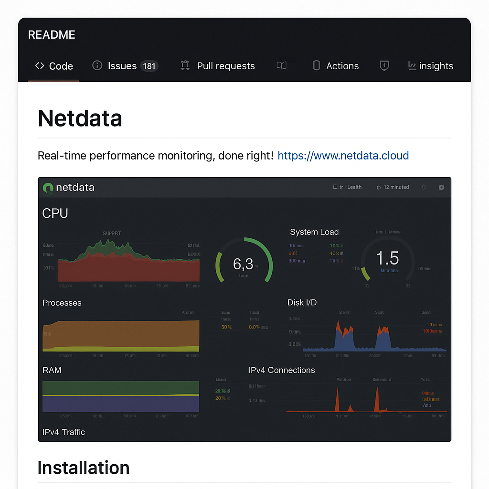

# 🖥️ Task 7: Monitor System Resources Using Netdata

This task was part of the Data Analyst Internship program, aimed at understanding real-time system and application performance metrics using **Netdata**.

## ✅ Objective

Install Netdata using Docker and explore the real-time system monitoring dashboard.

## 🛠 Tools Used

- Docker
- Netdata (Open-source monitoring tool)

## 📦 Setup & Usage

### Step 1: Run Netdata Container

```bash
docker run -d --name=netdata -p 19999:19999 --cap-add SYS_PTRACE --security-opt apparmor=unconfined netdata/netdata
```

### Step 2: Access the Dashboard

Open your browser and go to:  
[http://localhost:19999](http://localhost:19999)

Here you can monitor:
- CPU usage
- Memory utilization
- Disk I/O
- Docker container stats
- Network traffic
- System logs

### Step 3: Screenshot

See the `screenshot.png` in this repo for the live dashboard preview.

## ❓ Interview Questions Answered

1. **What does Netdata monitor?**  
   CPU, memory, disk, network, containers, applications, and more.

2. **How do you view real-time metrics?**  
   By accessing the local Netdata dashboard at `localhost:19999`.

3. **How is Netdata different from Prometheus?**  
   Netdata provides real-time, out-of-the-box monitoring with rich visuals. Prometheus is more complex, suitable for large-scale systems, and requires configuration.

4. **What is a collector?**  
   Collectors are plugins used by Netdata to gather metrics from different sources (like disk, CPU, Docker, etc.).

5. **What are some performance KPIs to watch?**  
   - CPU Load
   - Memory Usage
   - Disk I/O
   - Network Latency
   - Container Health

6. **How to deploy Netdata on a VM?**  
   SSH into your VM and run the Docker command to deploy Netdata.

7. **How does Netdata alerting work?**  
   Netdata uses built-in alarms and thresholds. You can customize alerts in `/etc/netdata/health.d/`.

8. **What is a dashboard in this context?**  
   A web-based interface showing live system and application metrics.

## 📸 Screenshot



## 📎 Submission

Task completed as per instructions.  
Submission link: [Google Form](https://forms.gle/qumsSk73uxUZ6LYB9)
